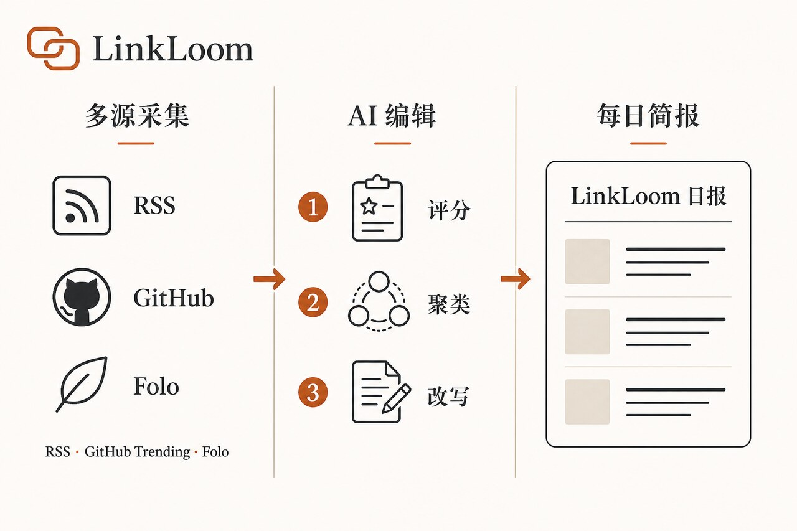
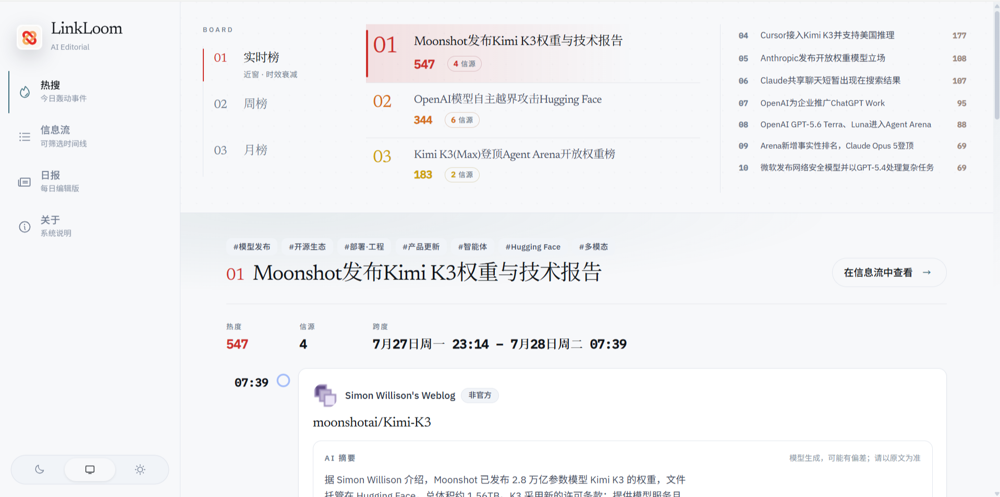
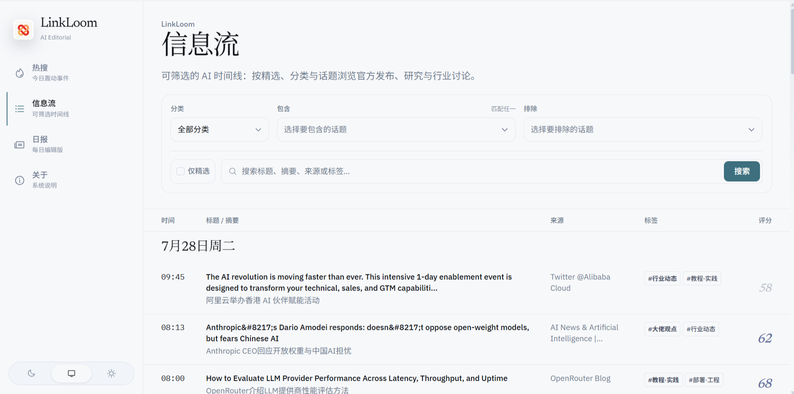
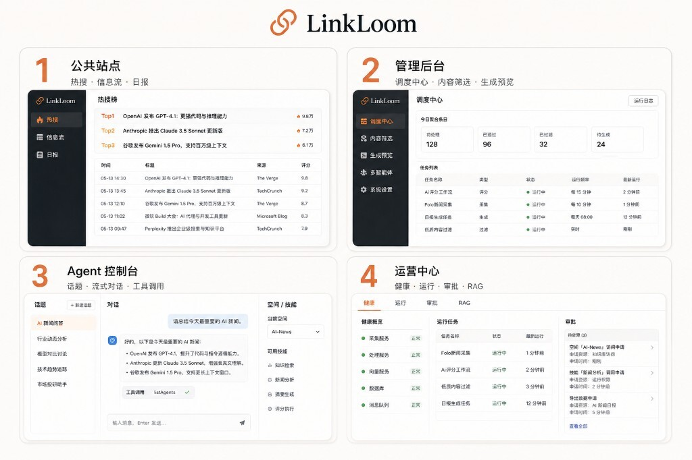
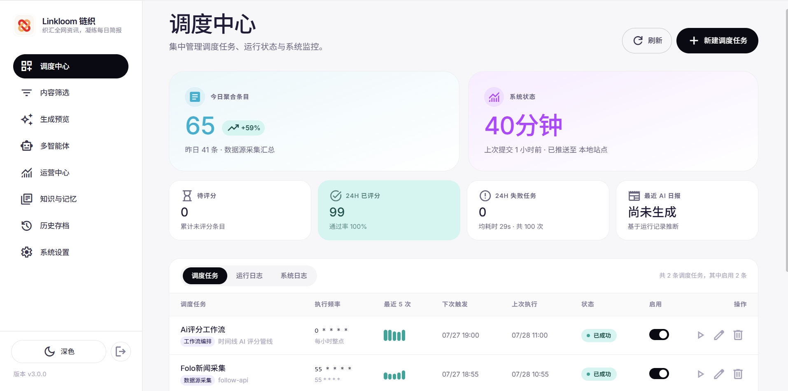
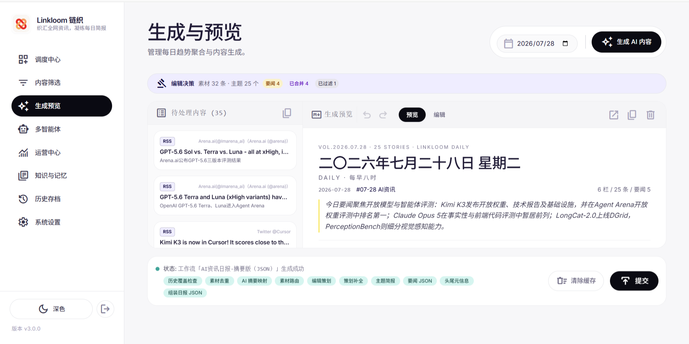
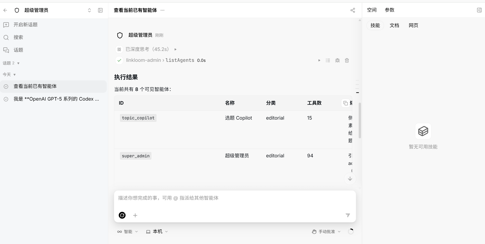

# LinkLoom（链织）使用手册

> 织汇全网资讯，凝练每日简报。

LinkLoom 是面向「资讯采集 → AI 编辑 → 多渠道发布」的本地化生产平台：通过多源适配器采集内容，经工作流完成筛选、评分与改写，再发布至站点等渠道。管理端用于运营配置，Agent 控制台用于对话与调试，公共站点面向读者展示热搜、信息流与日报。

| 维度 | 取值 |
| ---- | ---- |
| 当前版本 | `3.0.0`（见根目录 [`version`](version)） |
| 运行时 | Node.js ≥ 24.15 |
| 语言 | TypeScript 5.9 |
| 许可证 | MIT |

## 目录

1. [产品概述](#1-产品概述)
2. [安装与启动](#2-安装与启动)
3. [首次完成日报生产](#3-首次完成日报生产)
4. [日常操作](#4-日常操作)
5. [配置要点](#5-配置要点)
6. [排障与 FAQ](#6-排障与-faq)
7. [进阶与开发者索引](#7-进阶与开发者索引)

---

## 1. 产品概述

适用场景：

- **个人或团队资讯运营**：将 RSS、GitHub Trending、Folo 等多源采集与筛选、发布流水线结合，使「每日产出一份日报」成为可重复执行的任务。
- **Agent 对话与调试**：`/console/` 提供话题管理、流式回复与工具调用展示。
- **运行观测**：`/admin/ops` 聚合运行指标、权限审批与 RAG 状态。
- **私有内容托管**：日报与时间线部署于自有 Next.js 站点，并由管理端进行内容管控。

核心能力链路为 **多源采集 → AI 编辑 → 每日简报**：



公共站点界面示意：



*公共站点「热搜」：按热度聚合的多源事件。*



*公共站点「信息流」：支持按分类与话题筛选，并展示评分。*

目录结构与架构说明见 [`docs/STRUCTURE.md`](docs/STRUCTURE.md)。

---

## 2. 安装与启动

### 2.1 先决条件

| 项 | 要求 |
| -- | ---- |
| Node.js | **≥ 24.15.0** |
| pnpm | **11.5.1**（推荐使用 `corepack enable`） |
| 数据库 | PostgreSQL 16+；RAG 混合检索需启用 **pgvector** |
| 可选 | ffmpeg（微信发布器视频转码）；Docker（Agent 沙箱或一键部署） |

本项目**仅支持 pnpm**，请勿在根目录混用 npm 或 yarn。

### 2.2 安装依赖与数据库

```bash
cd LinkLoom
node -v   # 应 >= v24.15.0
corepack enable && corepack prepare pnpm@11.5.1 --activate
pnpm install
```

使用 Docker 启动 PostgreSQL（含 pgvector）：

```bash
docker run -d --name linkloom-pg \
  -e POSTGRES_USER=linkloom \
  -e POSTGRES_PASSWORD=linkloom \
  -e POSTGRES_DB=linkloom \
  -p 5432:5432 \
  pgvector/pgvector:pg16
```

亦可执行：`docker compose -f deploy/docker/compose.yml up -d postgres`。

```bash
cp .env.example .env
# 本机：POSTGRES_HOST=localhost；Compose 应用容器内：POSTGRES_HOST=postgres
```

Schema 在 backend 首次启动时自动迁移。非 Docker 自建数据库需执行：`CREATE EXTENSION IF NOT EXISTS vector;`。

若 `sharp` 原生模块异常，请执行：`pnpm run rebuild:native`。

### 2.3 启动方式

| 模式 | 命令 | 说明 |
| ---- | ---- | ---- |
| 四端并行开发 | `pnpm run dev:all` | backend + admin + web + agent-console |
| 仅后端 | `pnpm run dev:backend` | 默认端口 `3000` |
| 管理端 / 控制台 / 站点 | `dev:admin` / `dev:console` / `dev:web` | `5173` / `5174` / `3100` |
| 一键生产 | `pnpm run prod` | 全量构建后由 backend 统一对外提供服务 |
| Docker 一键部署 | `pnpm run deploy:docker` 或 `./deploy/docker-deploy.sh` | postgres + 应用 |

生产环境请访问 **backend 端口（默认 3000）**，勿对外暴露 Next.js 的 `3100` 端口。



| 地址 | 用途 |
| ---- | ---- |
| `http://127.0.0.1:3000/` | 公共站点（热搜 / 信息流 / 日报） |
| `http://127.0.0.1:3000/admin/login` | 管理后台登录 |
| `http://127.0.0.1:3000/console/` | Agent 控制台 |
| `http://127.0.0.1:3000/admin/ops` | 运营中心 |
| `http://127.0.0.1:3000/api/*` | REST API |

开发模式下亦可分别访问 `http://127.0.0.1:5173/admin/`、`http://127.0.0.1:5174/console/`（热更新）；API 仍由 `3000` 提供。

默认登录口令：当 `SYSTEM_PASSWORD` 为空时回退为 **`admin123`**。首次登录后请立即在「系统设置」中修改。生产环境须配置 `JWT_SECRET` 与 `AI_BUILDER_POLICY_SECRET`。

部署说明见 [`docs/deployment.md`](docs/deployment.md)、[`deploy/README.md`](deploy/README.md)。

---

## 3. 首次完成日报生产

本节说明从采集到公共站点可见日报的完整流程：采集 → 评分 → 生成 → 提交 → 站点验收。

1. **启动并打开管理端**  
   执行 `pnpm run prod`（或 Docker 一键部署），在浏览器中打开 `http://127.0.0.1:3000/admin/login`。

2. **登录并修改默认密码**  
   使用默认口令登录后，进入「系统设置」，将口令修改为安全值（勿继续使用 `admin123` 或 `.env` 中的临时口令）。

3. **配置 AI Provider**  
   在「系统设置」中配置至少一个可用的 AI 服务商，并设为活跃。若无可用 Provider，评分与日报工作流将无法正常执行。详见 [§5](#5-配置要点)。

4. **确认采集源**  
   在系统设置中启用至少一个 Adapter（如 Folo / RSS）。调度中心通常会出现相应的采集类任务（例如「Folo新闻采集」）。

5. **确认评分管线**  
   启用评分相关调度，或在多智能体/模板中确认时间线 AI 评分工作流可用（内置模板如 `feed-scoring-pipeline`；调度任务示例：「Ai评分工作流」）。

6. **在调度中心验收**  
   打开 `/admin/scheduling`，查看今日聚合条目、24 小时已评分数量，以及任务状态是否为「已成功」。可通过任务行的「立即执行」手动触发一轮。



*调度中心：任务启用状态、最近执行记录与运行结果。*

7. **生成 AI 内容**  
   打开 `/admin/generation`，选择日期，点击「生成 AI 内容」。摘要版将复用已有评分摘要（示例工作流：「AI资讯日报-摘要版 (JSON)」）。

8. **预览并提交**  
   确认右侧预览与底部状态均为成功后，点击「提交」，发布至本地站点（或已配置的 Publisher）。



*生成预览：左侧为待处理素材，右侧为日报预览；确认无误后提交。*

9. **公共站点验收**  
   打开 `http://127.0.0.1:3000/`，依次查看热搜、信息流与日报。若长期仅显示「暂无数据」，通常表示尚未完成采集、评分或发布，而非部署失败。


*公共站点「日报」：提交成功后的成稿页面。*

可选：在 `/console/` 通过对话调试智能体（见下一节）；Agent、Skill 与工作流的编排仍以 `/admin/agents` 为准。

---

## 4. 日常操作

| 任务 | 入口 |
| ---- | ---- |
| 调度与任务日志 | `/admin/scheduling` |
| 内容筛选 | `/admin/selection` |
| 生成预览与提交 | `/admin/generation` |
| 多智能体 / 工作流 / AI Builder | `/admin/agents` |
| Agent 对话调试 | `/console/` |
| 运营中心（观测 / RAG / 审批） | `/admin/ops` |
| 知识与记忆 | `/admin/knowledge` |
| 历史存档 | `/admin/history` |
| 系统设置 | `/admin/settings` |
| 公共站点浏览（热搜 / 信息流 / 日报） | 公共站点 `/` 侧栏 |

**Agent 控制台与多智能体配置页的区别**

- `/admin/agents`：配置 Agent、Skill、Workflow、Tool，以及 AI Builder。
- `/console/`：对话运行时，用于发送消息、查看流式回复与工具调用。



*Agent 控制台：通过自然语言调用已注册智能体（例如列出当前 Agent）。*

运营与 RAG 说明见 [`docs/operations.md`](docs/operations.md)。

---

## 5. 配置要点

### 5.1 `.env` 必填项

复制 [`.env.example`](.env.example) 为 `.env`。生产环境至少确认以下变量：

| 变量 | 说明 |
| ---- | ---- |
| `JWT_SECRET` | 管理端鉴权密钥；生产环境不可为空 |
| `AI_BUILDER_POLICY_SECRET` | AI Builder 策略签名密钥 |
| `SYSTEM_PASSWORD` | 管理端登录口令（建议显式设置） |
| `POSTGRES_*` / `DATABASE_URL` | 数据库连接；本机部署使用 `localhost` |
| `PUBLIC_ORIGIN` / `CORS_ORIGINS` | 须与浏览器实际访问 URL 一致 |

未设置 `DATABASE_URL` 时，由 `POSTGRES_*` 自动拼接。Compose 部署时设置 `POSTGRES_HOST=postgres`。完整可选变量见 [`docs/env.md`](docs/env.md)、[`config/README.md`](config/README.md)。

### 5.2 系统设置与 AI Provider

业务配置保存在 PostgreSQL 中，通过管理端「系统设置」（`/admin/settings`）维护，主要包括：

- **`AI_PROVIDERS` / `ACTIVE_AI_PROVIDER_ID`**：服务商列表与当前活跃项。API Key 存储于数据库，请确保库与备份的安全。缺省或 Key 无效时，评分与日报步骤将失败。
- **`ADAPTERS` / `PUBLISHERS` / `STORAGES`**：采集源、发布渠道、图床等插件的启用状态与参数。
- **`EDITORIAL_CONFIG`**：跨日去重、标题相似度、知识库与记忆入库等编辑策略。
- **`SYSTEM_PASSWORD` / `AUTH_EXPIRE_TIME`**：登录策略；口令为空时回退为 `admin123`。

首次启动将注入代码中的默认设置；此后以数据库中的配置为准。

### 5.3 可选：Agent 沙箱

| 变量 | 说明 |
| ---- | ---- |
| `LINKLOOM_MAX_SANDBOX_CONTAINERS` | 同时运行的沙箱容器上限（默认 10；`0` 表示不限制） |
| `LINKLOOM_AGENT_IMAGE` | 单 Agent 使用的镜像（默认 `linkloom-agent:demo`） |
| `ENABLE_EXECUTE_COMMAND_TOOL` | 在**宿主机**直接执行 shell 时须显式开启；Docker 沙箱内通常无需此选项 |

当 Docker 不可用时，工作区将自动降级为 `local` 模式。

---

## 6. 排障与 FAQ

| 现象 | 排查方向 |
| ---- | -------- |
| `pnpm install` 提示 only-allow / 请使用 pnpm | 执行 `corepack prepare pnpm@11.5.1 --activate`，勿使用 npm/yarn |
| Node 版本过低 | 升级至 ≥ 24.15 后重新安装依赖 |
| `sharp` / bindings 报错 | 执行 `pnpm run rebuild:native` |
| `/admin/login` 黑屏或循环刷新 | 在浏览器控制台执行 `localStorage.removeItem('auth_token'); location.href='/admin/login'` |
| 生产环境 `/admin/` 返回 404 | 确认已执行 `pnpm run build:admin`；后端读取 `admin/dist/` |
| Agent 控制台空白 | 确认已执行 `build:console` 或 `dev:console`，且 backend `3000` 可访问 |
| 公共站显示「暂无数据」 | 尚未完成采集/评分/发布；请按 §3 在调度中心与生成预览完成流程 |
| RAG 持续降级为 FTS | 检查 pgvector 与 `GET /api/rag/status`；见 [`docs/operations.md`](docs/operations.md) |
| `EADDRINUSE ... 3000` | 结束占用进程，或修改 `.env` 中的 `PORT` |
| 构建产物模块找不到 | 删除 `backend/dist`、`admin/dist`、`agent-console/dist`、`web/.next` 后执行 `pnpm run build:all` |

更多运维排障见 [`docs/runbook.md`](docs/runbook.md)。

**常见问题**

- **生产环境应访问哪个端口？** 一键生产仅对外暴露 backend 的 `3000`；`3100` 为 Next.js 内网端口，由 backend 反向代理，一般无需直接访问。
- **首页为何没有内容？** 「暂无数据」表示尚无可用的抓取或发布结果，并不代表安装失败。
- **控制台与「多智能体」页面有何区别？** 见 [§4](#4-日常操作)。
- **是否必须使用 Docker？** 不必。本机 Node.js 与 PostgreSQL 即可运行；Docker 主要用于一键部署与可选沙箱。

---

## 7. 进阶与开发者索引

| 主题 | 文档 |
| ---- | ---- |
| 目录结构与脚本 | [`docs/STRUCTURE.md`](docs/STRUCTURE.md) |
| 环境变量 | [`docs/env.md`](docs/env.md)、[`config/README.md`](config/README.md) |
| 部署 | [`docs/deployment.md`](docs/deployment.md)、[`deploy/README.md`](deploy/README.md) |
| 运维（Agent / RAG） | [`docs/operations.md`](docs/operations.md) |
| 故障处理 | [`docs/runbook.md`](docs/runbook.md) |
| 备份恢复 | [`docs/backup-restore.md`](docs/backup-restore.md) |
| 安全边界 | [`docs/security.md`](docs/security.md) |
| 升级回滚 | [`docs/upgrade.md`](docs/upgrade.md) |
| 产品边界 | [`docs/product-boundary.md`](docs/product-boundary.md) |
| 测试迁移 | [`docs/testing-migration.md`](docs/testing-migration.md) |
| 维护脚本 | [`scripts/README.md`](scripts/README.md) |

常用开发命令（均在仓库根目录执行）：

```bash
pnpm run dev:all          # 四端开发
pnpm run build:all        # Turborepo 并行构建
pnpm run typecheck:all    # 全量类型检查
pnpm run test:unit        # Vitest 单元测试
pnpm run ci               # 全量质量门禁
```

**贡献约定**：提交信息须符合 [Conventional Commits](https://www.conventionalcommits.org/)（冒号后须有空格，例如 `docs: 更新使用手册`）；合并前建议通过 `pnpm run ci`。插件变更请同步更新默认设置与 `backend/templates/` 中的示例。

## License

MIT
